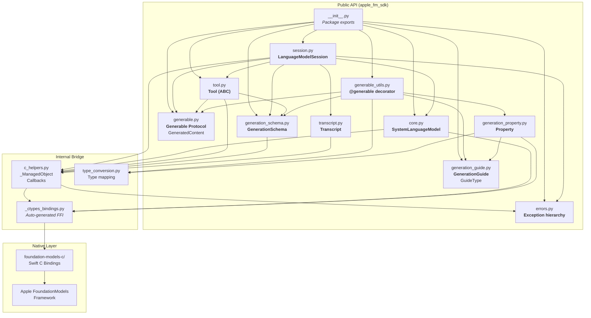
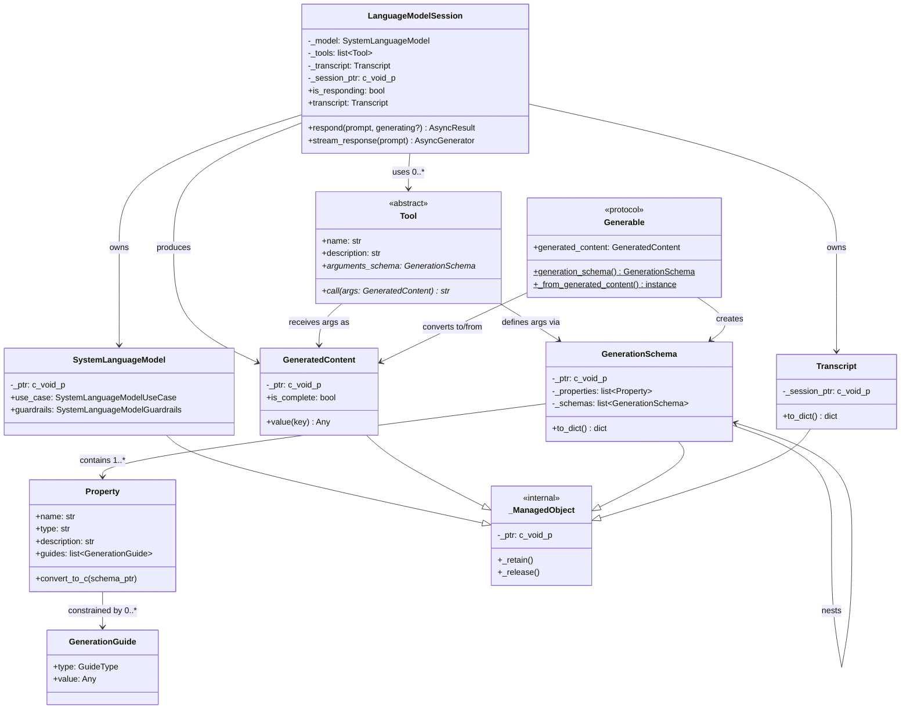
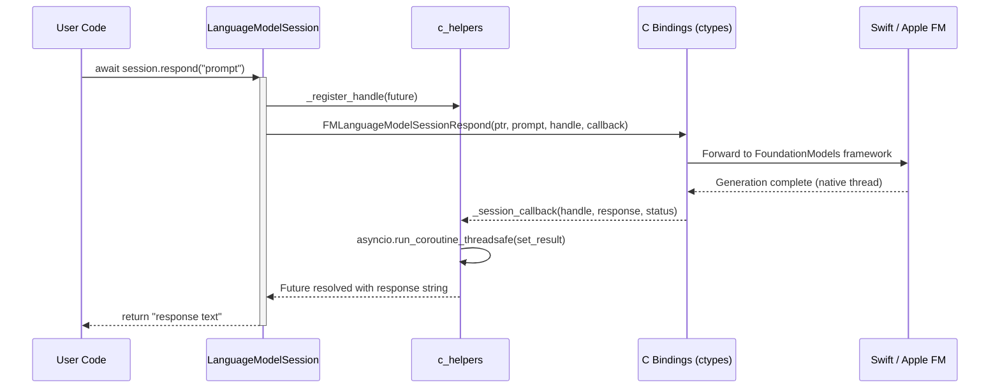
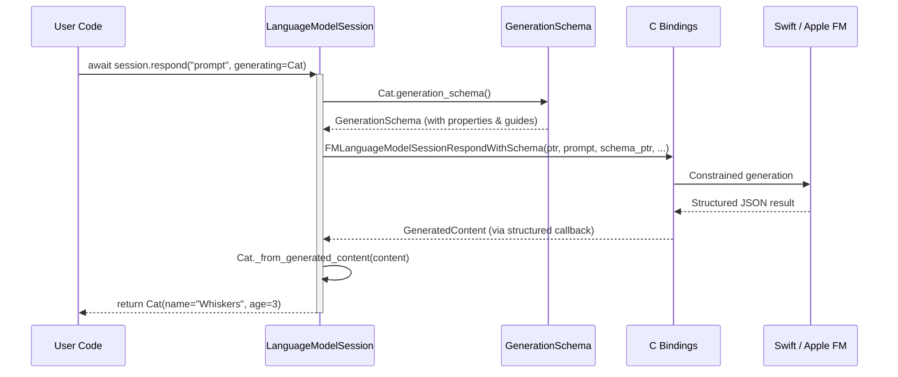
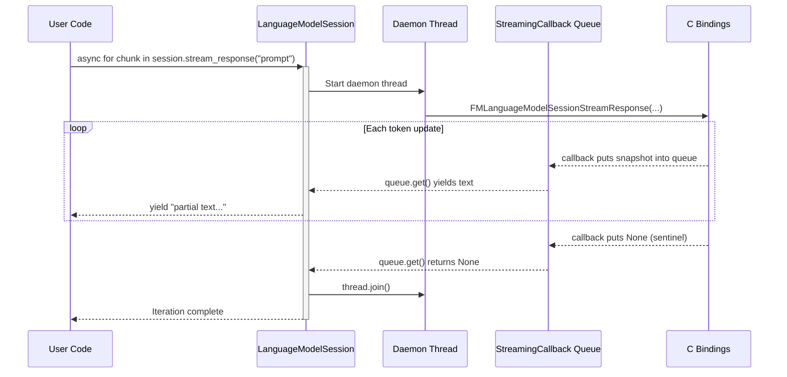
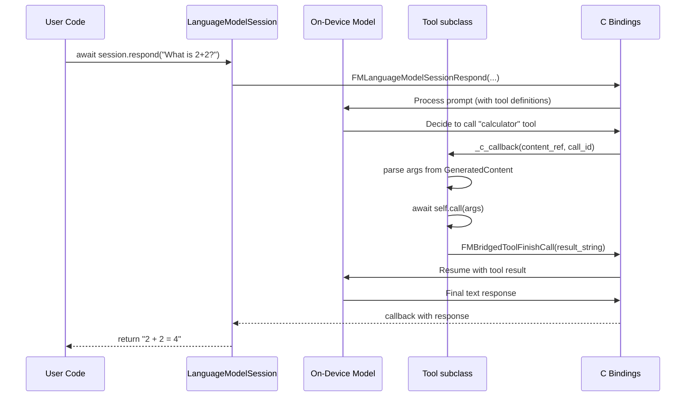

# Python Apple Foundation Models SDK - Architecture

## High-Level Overview

```
+------------------------------------------------------------------+
|                        User Application                          |
|  (async/await Python code using apple_fm_sdk)                    |
+------------------------------------------------------------------+
        |                    |                     |
        v                    v                     v
+----------------+  +------------------+  +-----------------+
| LanguageModel  |  |  @generable      |  |    Tool         |
| Session        |  |  Decorator       |  |  (ABC)          |
| - respond()    |  |  + Generation    |  |  - call()       |
| - stream()     |  |    Schema/Guide  |  |  - args_schema  |
| - transcript   |  |  + Property      |  |                 |
+----------------+  +------------------+  +-----------------+
        |                    |                     |
        v                    v                     v
+------------------------------------------------------------------+
|                   Python/C Bridge Layer                           |
|  c_helpers.py: _ManagedObject, callbacks, handle registry        |
|  type_conversion.py: Python <-> Swift type mapping               |
+------------------------------------------------------------------+
        |
        v
+------------------------------------------------------------------+
|              _ctypes_bindings.py  (auto-generated)               |
|  ctypes FFI bindings to libFoundationModels C API                |
+------------------------------------------------------------------+
        |
        v
+------------------------------------------------------------------+
|              foundation-models-c  (Swift Package)                |
|  FoundationModelsCBindings.swift + FoundationModels.h            |
|  C-compatible wrappers around Swift FoundationModels framework   |
+------------------------------------------------------------------+
        |
        v
+------------------------------------------------------------------+
|           Apple FoundationModels Framework (macOS 26+)           |
|               On-Device Foundation Model                         |
+------------------------------------------------------------------+
```

## Module Dependency Graph



## Class Relationships



## Data Flow

### 1. Basic Text Generation



### 2. Guided (Structured) Generation



### 3. Streaming



### 4. Tool Calling



## Error Handling Architecture

```
FoundationModelsError (base)
├── GenerationError (base for generation failures)
│   ├── ExceededContextWindowSizeError
│   ├── AssetsUnavailableError
│   ├── GuardrailViolationError
│   ├── UnsupportedGuideError
│   ├── UnsupportedLanguageOrLocaleError
│   ├── DecodingFailureError
│   ├── RateLimitedError
│   ├── ConcurrentRequestsError
│   └── RefusalError
├── ToolCallError
└── InvalidGenerationSchemaError
```

Errors originate as C status codes, are mapped via `GenerationErrorCode` enum, and raised as typed Python exceptions through `_status_code_to_exception()`.

## Memory Management

```
Python (_ManagedObject)          C / Swift
─────────────────────────        ─────────────
__init__(ptr)  ←─────────────── passRetained() [+1 refcount]
                                 ownership transferred to Python
    ...object in use...

__del__()  ──────────────────── FMRelease(ptr)  [-1 refcount]
                                 if refcount == 0: dealloc

Callback Safety:
  _register_handle(obj) ───────► _active_handles[id(obj)] = obj
      prevents GC while C holds reference
  _unregister_handle(obj) ─────► del _active_handles[id(obj)]
      allows GC after callback completes
```

## Build Pipeline

```
pyproject.toml
    │
    ▼
build_backend.py (PEP 517)
    │
    ├──► Check macOS 26+ & Xcode 26+
    │
    ├──► swift build -c release
    │    └──► libFoundationModels.dylib
    │
    ├──► Copy .dylib → src/apple_fm_sdk/lib/
    │
    ├──► ctypesgen FoundationModels.h → _ctypes_bindings.py
    │    └──► Post-process: inject runtime library path
    │
    └──► setuptools.build_meta → .whl package
```

## Directory Structure

```
python-apple-fm-sdk/
├── src/apple_fm_sdk/               # Python SDK package
│   ├── __init__.py                 #   Public API exports
│   ├── core.py                     #   SystemLanguageModel & config enums
│   ├── session.py                  #   LanguageModelSession (main entry point)
│   ├── generable.py                #   Generable protocol & GeneratedContent
│   ├── generable_utils.py          #   @generable decorator implementation
│   ├── generation_schema.py        #   GenerationSchema (C-backed)
│   ├── generation_property.py      #   Property for schema fields
│   ├── generation_guide.py         #   GenerationGuide constraints
│   ├── tool.py                     #   Tool abstract base class
│   ├── transcript.py               #   Session history
│   ├── errors.py                   #   Exception hierarchy
│   ├── c_helpers.py                #   Python/C bridge utilities
│   ├── type_conversion.py          #   Python <-> Swift type mapping
│   └── _ctypes_bindings.py         #   Auto-generated ctypes FFI
│
├── foundation-models-c/            # Swift C bindings package
│   ├── Package.swift               #   Swift package manifest
│   └── Sources/
│       ├── FoundationModelsCBindings/
│       │   ├── include/
│       │   │   └── FoundationModels.h    # C API header
│       │   └── FoundationModelsCBindings.swift
│       └── FoundationModelsCDeclarations/
│
├── examples/                       # Usage examples
│   ├── simple_inference.py
│   ├── streaming_example.py
│   └── transcript_processing.py
│
├── tests/                          # Test suite (pytest)
├── docs/                           # Sphinx documentation
├── build_backend.py                # Custom PEP 517 build backend
└── pyproject.toml                  # Project configuration
```
